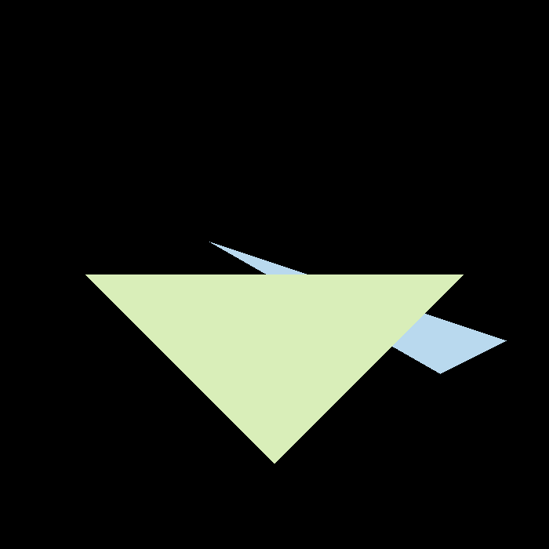
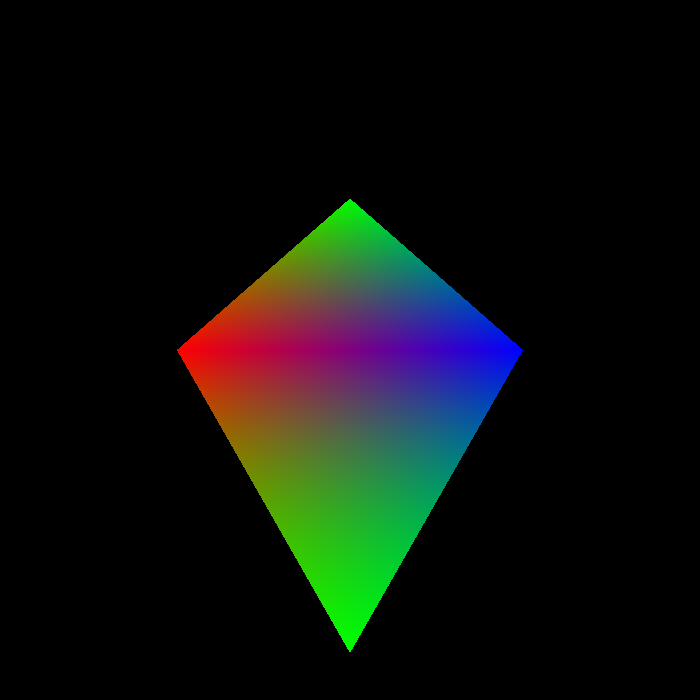

# GSoC-Rendering-module-in-OpenCV
This repository summarize the current progress and future plans for the GSoC 2023 project ["Simple triangle rendering"](https://summerofcode.withgoogle.com/programs/2023/projects/8QunCuzv)

__student:__ Ningyu Zhu  
__Mentor:__ Rostislav Vasilikhin

- Pull Request: [opencv/pull/24065](https://github.com/opencv/opencv/pull/24065)
- Rendering Code: [opencv/opencv3d](https://github.com/nickyu-zhu/opencv/tree/Ningyu-dev)

## Introduction
---
In this project, I am primarily focused on developing triangle rasterization functions for the OpenCV 3D module. The scope of my work encompasses three distinct phases: the development of the triangle rasterization function, the integration of OpenGL samples for illustrative purposes, and performance and accuracy testing using Google's internal test framework.
## Results
---
### Computer Environment
__Hardware:__  
CPU: Intel(R) Core(TM) i7=12700H GPU: NVIDIA Geforce RTX 3060 Laptop  
__Software:__  
Windows 11 OpenCV-5.x Visual Studio 2019
### Depth rendering result

### Color rendering result

## Future work
---
Due to time constraints, the optional components of this project – rendering optimization using OpenCL and Jacobian matrix calculations – are still in development. These components will constitute the future work to be undertaken after the standard GSoC deadline.
## References
---
- [Triangle rasterization tutorial](https://www.scratchapixel.com/lessons/3d-basic-rendering/rasterization-practical-implementation/rasterization-stage.html)
- [3D module in OpenCV](https://docs.opencv.org/5.x/da/d35/group____3d.html)
- [OpenGL interoperability in OpenCV](https://docs.opencv.org/5.x/d2/d3c/group__core__opengl.html)